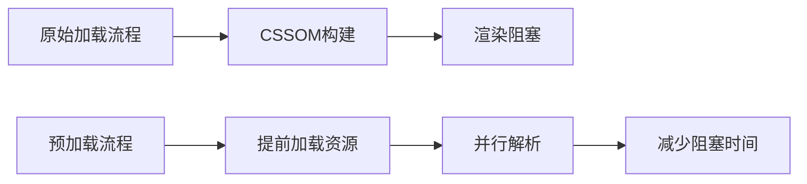

### Webpack5插件开发的具体实践？
#### eg:资源预加载插件
```javascript
class EnhancedPreloadPlugin {
  constructor(options) {
    this.patterns = options?.resources || [];
  }
  // 插件必须实现的apply方法
  apply(compiler) {
    // 注册到compilation生命周期钩子
    compiler.hooks.compilation.tap('PreloadPlugin', (compilation) => {
      compilation.hooks.htmlWebpackPluginAlterAssetTags.tapAsync(
        'PreloadPlugin',
        (data, cb) => {
          
          // 遍历所有构建产物
          const assets = compilation.getAssets();
          
          this.patterns.forEach(({ test, asType }) => {
            const matchedAsset = assets.find(asset => test.test(asset.name));
            
            if (matchedAsset) {
              // 向HTML头部添加预加载标签
              data.head.push({
                tagName: 'link',
                attributes: {
                  rel: 'preload',
                  href: matchedAsset.name,
                  as: asType,
                  crossorigin: asType === 'font' ? 'anonymous' : undefined
                }
              });
            }
          });
        // 必须调用回调通知webpack继续流程
          cb(null, data);
        }
      );
    });
  }
}

// 使用示例
new EnhancedPreloadPlugin({
  resources: [
    { test: /critical\.css$/, asType: 'style' },
    { test: /font\.woff2$/, asType: 'font' }
  ]
})
/* 注意：必须在html-webpack-plugin之后加载，在压缩插件之前 */
```


#### 核心实现原理

1.钩子机制
利用Webpack的Tapable事件流系统：
- `compilation`:编译上下文创建时触发
- `htmlWebpackPluginAlterAssetTags`:在生成HTML前修改资源标签

2.执行实际
- 在HTML文件生成前，通过修改AST节点添加预加载标签

3.关键配置项
- `rel="preload"`:声明预加载优先级
- `as="style"`:帮助浏览器正确设置优先级和请求头
- `href`:需与实际构建输出路径匹配

### 动态权限体系如何实现多角色差异化操作
```html
1.路由层面：基于角色配置路由白名单（后端配合完成）
2.组件层面: 封装权限指令`v-auth`,webHooks`hasPermission`校验当前角色权限
3.接口层面：中间件拦截请求校验JWT中的角色声明
4.数据层面：服务端返回字段级权限标识，前端动态渲染UI
5.审计日志：记录关键操作的角色上下文信息
```

### 内存泄漏排查的具体方法论？
#### 排查流程
```html
1.Chrome Memory面板创建Heap Snapshot
2.对比操作前后的内存快照，筛选Detached DOM节点
3.查找未释放的事件监听（特别是全局事件）
4.检查未清除的定时器/请求回调引用
5.WeakMap替代普通Map存储临时数据
6.使用Chrome Performance Monitor观察内存增长曲线
```
#### 具体案例
- 未解绑的IntersectionObserver实例
- 缓存策略不当导致的历史数据堆积
- 闭包中意外保留的大对象引用

### 大文件切片上传的技术实现细节

#### 核心流程：
```
1.前端通过SparkMD5计算文件指纹
2.按5MB分片，并发3个分片上传
3.每个分片包含：chunkIndex/fileHash/signature
4.服务端通过MinIO SDK合并分片
5.实现断点续传：本地存储已上传分片索引
```
#### 可优化点：
- 采用Web Workers处理文件哈希计算
- 进度条使用requestAnimationFrame平滑渲染
- 错误分片加入重试队列（最多3次）
