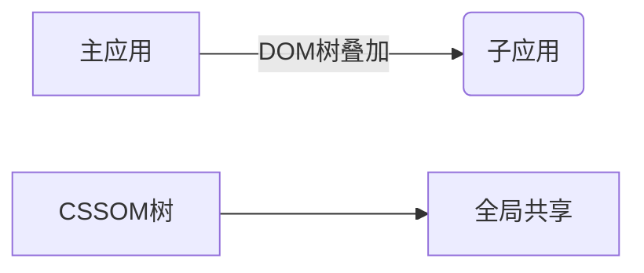
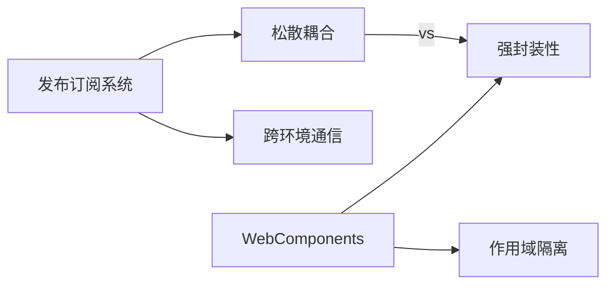

# 基于micro-app的微前端实现原理深度解析

## 核心架构设计思想

*采用Web Components + HTML Entry方案，实现真正意义上的零成本接入*

---

## 核心实现机制

### 1.自定义元素加载器
```javascript
// 注册<micro-app>自定义元素
class MicroAppElement extends HTMLElement {
   // 声明需要监听的属性名，只有这些属性变化时才会触发attributeChangedCallback
  static get observedAttributes () {
    return ['name', 'url']
  }
  constructor() {
    super();
    this.attachShadow({ mode: 'open' }); // 创建Shadow DOM
  }

  connectedCallback() {
    this.loadApp(); // 元素挂载时加载子应用
  }

  disconnectedCallback() {
    this.unmount(); // 元素移除时卸载子应用
  }
  attributeChangedCallback (attrName, oldVal, newVal) {
    // 元素属性发生变化时执行,分别记录name及url的值
    if (attrName === 'name' && !this.name && newVal) {
      this.name = newVal
    } else if (attrName === 'url' && !this.url && newVal) {
      this.url = newVal
    }
  }
}
window.customElements.define('micro-app', MicroAppElement);
```
### 2.渲染
通过自定义元素micro-app的生命周期函数`connectedCallback`监听元素被渲染，加载子应用的html并转换为DOM结构，递归查询所有js和css等静态资源并加载，设置元素隔离，拦截所有动态创建的script、link等标签，提取标签内容。将加载的js经过插件系统处理后放入沙箱中运行，对css资源进行样式隔离，最后将格式化后的元素放入micro-app中，最终将micro-app元素渲染为一个微前端的子应用。在渲染的过程中，会执行开发者绑定的生命周期函数，用于进一步操作。
```javascript

export default class CreateApp {
  constructor ({ name, url, container }) {
    this.name = name // 应用名称
    this.url = url  // url地址
    this.container = container // micro-app元素
    this.status = 'loading'
    loadHtml(this)
    this.sandbox = new Sandbox(name)
  }

  status = 'created' // 组件状态，包括 created/loading/mount/unmount

  // 存放应用的静态资源
  source = { 
    links: new Map(), // link元素对应的静态资源
    scripts: new Map(), // script元素对应的静态资源
  }

  // 资源加载完时执行
  onLoad (htmlDom) {
    this.loadCount = this.loadCount ? this.loadCount + 1 : 1
    // 第二次执行且组件未卸载时执行渲染
    if (this.loadCount === 2 && this.status !== 'unmount') {
      // 记录DOM结构用于后续操作
      this.source.html = htmlDom
      // 执行mount方法
      this.mount()
    }
  }

  /**
   * 资源加载完成后进行渲染
   */
  mount () {
    // 克隆DOM节点
    const cloneHtml = this.source.html.cloneNode(true)
    // 创建一个fragment节点作为模版，这样不会产生冗余的元素
    const fragment = document.createDocumentFragment()
    Array.from(cloneHtml.childNodes).forEach((node) => {
      fragment.appendChild(node)
    })

    // 将格式化后的DOM结构插入到容器中
    this.container.appendChild(fragment)

    // 执行js
    this.source.scripts.forEach((info) => {
      (0, eval)(info.code)
    })

    // 标记应用为已渲染
    this.status = 'mounted'

    this.sandbox.start()
    // 执行js
    this.source.scripts.forEach((info) => {
      (0, eval)(this.sandbox.bindScope(info.code))
      /* 修改上下文 逗号会返回表达式右边的值
      将eval作为函数使用
      */
    })
  }

  /**
   * 卸载应用 执行关闭沙箱，清空缓存等操作
   * @param destory 是否完全销毁，删除缓存资源
   */
  unmount (destory) {
    // 更新状态
    this.status = 'unmount'
    // 清空容器
    this.container = null
    this.sandbox.stop()
    // destory为true，则删除应用
    if (destory) {
      appInstanceMap.delete(this.name)
    }
  }
}

connectedCallback () {
  // 创建微应用实例
  const app = new CreateApp({
    name: this.name,
    url: this.url,
    container: this,
  })

  // 记入缓存，用于后续功能
  appInstanceMap.set(this.name, app)
}
```


### 3.实现js沙箱

```javascript
export default class SandBox {
  active = false // 沙箱是否在运行
  microWindow = {} // // 代理的对象
  injectedKeys = new Set() // 新添加的属性，在卸载时清空

  constructor () {
    this.proxyWindow = new Proxy(this.microWindow, {
      // 取值
      get: (target, key) => {
        // 优先从代理对象上取值
        if (Reflect.has(target, key)) {
          return Reflect.get(target, key)
        }

        // 否则兜底到window对象上取值
        const rawValue = Reflect.get(window, key)

        // 如果兜底的值为函数，则需要绑定window对象，如：console、alert等
        if (typeof rawValue === 'function') {
          const valueStr = rawValue.toString()
          // 排除构造函数
          if (!/^function\s+[A-Z]/.test(valueStr) && !/^class\s+/.test(valueStr)) {
            return rawValue.bind(window)
          }
        }

        // 其它情况直接返回
        return rawValue
      },
      // 设置变量
      set: (target, key, value) => {
        // 沙箱只有在运行时可以设置变量
        if (this.active) {
          Reflect.set(target, key, value)

          // 记录添加的变量，用于后续清空操作
          this.injectedKeys.add(key)
        }

        return true
      },
      deleteProperty: (target, key) => {
        // 当前key存在于代理对象上时才满足删除条件
        if (target.hasOwnProperty(key)) {
          return Reflect.deleteProperty(target, key)
        }
        return true
      },
    })
  }
  // 启动
  start () {
    if (!this.active) {
      this.active = true
    }
  }

  // 停止
  stop () {
    if (this.active) {
      this.active = false

      // 清空变量
      this.injectedKeys.forEach((key) => {
        Reflect.deleteProperty(this.microWindow, key)
      })
      this.injectedKeys.clear()
    }
  }
  // 修改js作用域
  bindScope (code) {
    window.proxyWindow = this.proxyWindow
    return `;(function(window, self){with(window){;${code}\n}}).call(window.proxyWindow, window.proxyWindow, window.proxyWindow);`
  }
  /* 使用with修改js作用域 */
  ...
}

```
### 4.实现样式隔离

子应用的所有元素都被插入到`micro-app`标签中，且`micro-app`标签具有唯一的name值，所以通过添加属性选择器前缀`micro-app[name=xxx]`可以让css样式在指定的`micro-app`内生效。
```css
micro-app[name=xxx] .test { height: 100px; }
```
当style元素被插入到文档中时，浏览器会自动为style元素创建CSSStyleSheet样式表，一个 CSS 样式表包含了一组表示规则的 CSSRule 对象。每条 CSS 规则可以通过与之相关联的对象进行操作，这些规则被包含在 CSSRuleList 内，可以通过样式表的 cssRules 属性获取。
```javascript
let templateStyle // 模版sytle

/**
 * 进行样式隔离
 * @param {HTMLStyleElement} styleElement style元素
 * @param {string} appName 应用名称
 */
export default function scopedCSS (styleElement, appName) {
  // 前缀
  const prefix = `micro-app[name=${appName}]`

  // 初始化时创建模版标签
  if (!templateStyle) {
    templateStyle = document.createElement('style')
    document.body.appendChild(templateStyle)
    // 设置样式表无效，防止对应用造成影响
    templateStyle.sheet.disabled = true
  }

  if (styleElement.textContent) {
    // 将元素的内容赋值给模版元素
    templateStyle.textContent = styleElement.textContent
    // 格式化规则，并将格式化后的规则赋值给style元素
    styleElement.textContent = scopedRule(Array.from(templateStyle.sheet?.cssRules ?? []), prefix)
    // 清空模版style内容
    templateStyle.textContent = ''
  } else {
    // 监听动态添加内容的style元素
    const observer = new MutationObserver(function () {
      // 断开监听
      observer.disconnect()
      // 格式化规则，并将格式化后的规则赋值给style元素
      styleElement.textContent = scopedRule(Array.from(styleElement.sheet?.cssRules ?? []), prefix)
    })

    // 监听style元素的内容是否变化
    observer.observe(styleElement, { childList: true })
  }
}

```
#### 有限性
只是将子应用的作用域限制了，父应用的样式还是会污染子应用。


### 5.事件通信
微前端各个应用本身是独立运行的，通信系统不应该对应用侵入太深，所以我们采用发布订阅系统。但是由于子应用封装在micro-app标签内，作为一个类webComponents的组件，发布订阅系统的弱绑定和它格格不入。

```javascript
// 发布订阅系统
class EventCenter {
  // 缓存数据和绑定函数
  eventList = new Map()
  /**
   * 绑定监听函数
   * @param name 事件名称
   * @param f 绑定函数
   */
  on (name, f) {
    let eventInfo = this.eventList.get(name)
    // 如果没有缓存，则初始化
    if (!eventInfo) {
      eventInfo = {
        data: {},
        callbacks: new Set(),
      }
      // 放入缓存
      this.eventList.set(name, eventInfo)
    }

    // 记录绑定函数
    eventInfo.callbacks.add(f)
  }

  // 解除绑定
  off (name, f) {
    const eventInfo = this.eventList.get(name)
    // eventInfo存在且f为函数则卸载指定函数
    if (eventInfo && typeof f === 'function') {
      eventInfo.callbacks.delete(f)
    }
  }

  // 发送数据
  dispatch (name, data) {
    const eventInfo = this.eventList.get(name)
    // 当数据不相等时才更新
    if (eventInfo && eventInfo.data !== data) {
      eventInfo.data = data
      // 遍历执行所有绑定函数
      for (const f of eventInfo.callbacks) {
        f(data)
      }
    }
  }
}

// 创建发布订阅对象
const eventCenter = new EventCenter()

```
自定义元素无法支持对象类型的属性，只能传递字符串，例如`<micro-app data={x: 1}></micro-app> `会转换为 `<micro-app data='[object Object]'></micro-app>`，想要以组件化形式进行数据通信必须让元素支持对象类型属性，为此我们需要重写`micro-app`原型链上`setAttribute`方法处理对象类型属性:
```javascript
// 记录原生方法
const rawSetAttribute = Element.prototype.setAttribute

// 重写setAttribute
Element.prototype.setAttribute = function setAttribute (key, value) {
  // 目标为micro-app标签且属性名称为data时进行处理
  if (/^micro-app/i.test(this.tagName) && key === 'data') {
    if (toString.call(value) === '[object Object]') {
      // 克隆一个新的对象
      const cloneValue = {}
      Object.getOwnPropertyNames(value).forEach((propertyKey) => {
        // 过滤vue框架注入的数据
        if (!(typeof propertyKey === 'string' && propertyKey.indexOf('__') === 0)) {
          cloneValue[propertyKey] = value[propertyKey]
        }
      })
      // 发送数据
      BaseAppData.setData(this.getAttribute('name'), cloneValue)
    }
  } else {
    rawSetAttribute.call(this, key, value)
  }
}
```