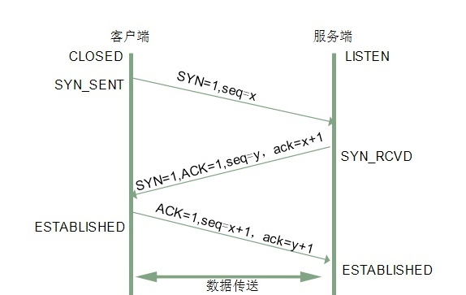
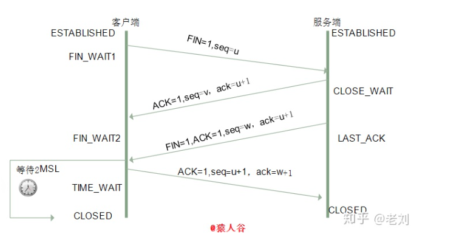

### Q1: http协议中，从用户输入url地址，会发生什么？
1.浏览器解析url，查看本地缓存（浏览器缓存，页面缓存，路由缓存等），如果有直接显示；
2.如果都没有，进行dns解析，解析出对应得IP地址
3.浏览器与服务器三次握手，建立tcp链接
4，浏览器发出http请求
5，服务器响应，返回对应得资源
6，浏览器接收数据后解析渲染页面
7，四次挥手，断开连接

### Q2：http协议中，缓存机制有哪些，如何命中？
#### A2:强缓存、协商缓存。
强缓存与协商缓存的命中，由响应头Response Headers确定（服务器返回）。
##### 强缓存
响应头中的 status 是 200，相关字段有expires（http1.0）,cache-control（http1.1)，两者同时出现时 cache-control 优先级更高。主要是利用 cache-control 的max-age值来进行判断。
```js
浏览器再次请求服务器时，浏览器会先判断max-age，如果到期则直接请求服务器，否则直接从缓存中读取。
```
##### 协商缓存
响应头中的 status 是 304，相关字段有 Etag / If-No-Match，Last-Modified / If-Modified-Since。
（1） 服务器的 ETag 和 浏览器的 If-None-Match 对应：
```js
Etag（服务器）: 上次加载时，服务器的 response header 返回的；
If-No-Match（浏览器）： 浏览器请求时的 request header 里的，取的是 Etag 的值。
```
如果服务器为请求的资源确定的 ETag 标头的值与浏览器请求中的 If-None-Match 值相同，则服务器将返回 304 Not Modified。表示资源文件没有发生改变，命中协商缓存。

（2）服务器的 Last-Modified 和 浏览器请求的 If-Modified-Since 对应：
```js
Last-Modified（服务器）：该资源文件最后一次更改时间，服务器的 response header 里返回；
If-Modified-Since（浏览器）：浏览器请求时的 request header 里的，取的是 Last-Modify 的值
```
在下一次发送请求时，服务器在接收到会做比对，如果相同，则命中协商缓存。
### Q3：http协议 与 https协议 有什么区别？
#### http协议是明文传输，https协议是http协议+ssl协议构建的，加密传输协议
1.http 的连接很简单，是无状态的。
2.http 传输的数据都是未加密的，是明文传输。
3.https 协议是由 http和ssl协议构建的可进行加密传输和身份认证的网络协议，比http协议的安全性更高。可防止数据在传输过程中不被窃取、改变，确保数据的完整性。
4.https 协议需要ca证书，费用较高。ssl 证书也需要钱，功能越强大的证书费用越高。
### Q4:TCP和UDP的区别
#### 区别如下：
1.TCP是面向连接的，UDP 是无连接的，即发送数据前不需要先建立链接。
2.TCP提供可靠的服务。也就是说，通过TCP连接传送的数据，无差错，不丢失，不重复，且按序到达；UDP尽最大努力交付，即不保证可靠交付。 并且因为tcp可靠，面向连接，不会丢失数据因此适合大数据量的交换。
3.TCP是面向字节流，UDP面向报文，并且网络出现拥塞不会使得发送速率降低（因此会出现丢包，对实时的应用比如IP电话和视频会议等）。
4.TCP只能是1对1的，UDP支持1对1,1对多。
5.TCP是面向连接的可靠性传输，而UDP是不可靠的。
### Q5：三次握手
##### 三次握手（Three-way Handshake）其实就是指建立一个TCP连接时，需要客户端和服务器总共发送3个包。进行三次握手的主要作用就是为了确认双方的接收能力和发送能力是否正常、指定自己的初始化序列号为后面的可靠性传送做准备。实质上其实就是连接服务器指定端口，建立TCP连接，并同步连接双方的序列号和确认号，交换TCP窗口大小信息。

第一次握手：客户端给服务端发一个 SYN 报文，并指明客户端的初始化序列号 ISN©。此时客户端处于 SYN_SEND 状态。

首部的同步位SYN=1，初始序号seq=x，SYN=1的报文段不能携带数据，但要消耗掉一个序号。

第二次握手：服务器收到客户端的 SYN 报文之后，会以自己的 SYN 报文作为应答，并且也是指定了自己的初始化序列号 ISN(s)。同时会把客户端的 ISN + 1 作为ACK 的值，表示自己已经收到了客户端的 SYN，此时服务器处于 SYN_REVD 的状态。

在确认报文段中SYN=1，ACK=1，确认号ack=x+1，初始序号seq=y。

第三次握手：客户端收到 SYN 报文之后，会发送一个 ACK 报文，当然，也是一样把服务器的 ISN + 1 作为 ACK 的值，表示已经收到了服务端的 SYN 报文，此时客户端处于 ESTABLISHED 状态。服务器收到 ACK 报文之后，也处于 ESTABLISHED 状态，此时，双方已建立起了连接。

确认报文段ACK=1，确认号ack=y+1，序号seq=x+1（初始为seq=x，第二个报文段所以要+1），ACK报文段可以携带数据，不携带数据则不消耗序号。
#### 为什么需要三次握手，两次不行吗？
第一次握手：客户端发送网络包，服务端收到了。

这样服务端就能得出结论：客户端的发送能力、服务端的接收能力是正常的。

第二次握手：服务端发包，客户端收到了。

这样客户端就能得出结论：服务端的接收、发送能力，客户端的接收、发送能力是正常的。不过此时服务器并不能确认客户端的接收能力是否正常。

第三次握手：客户端发包，服务端收到了。

这样服务端就能得出结论：客户端的接收、发送能力正常，服务器自己的发送、接收能力也正常。

因此，需要三次握手才能确认双方的接收与发送能力是否正常。
#### 三次握手过程中可以携带数据吗？
其实第三次握手的时候，是可以携带数据的。但是，第一次、第二次握手不可以携带数据

为什么这样呢?大家可以想一个问题，假如第一次握手可以携带数据的话，如果有人要恶意攻击服务器，那他每次都在第一次握手中的 SYN 报文中放入大量的数据。因为攻击者根本就不理服务器的接收、发送能力是否正常，然后疯狂着重复发 SYN 报文的话，这会让服务器花费很多时间、内存空间来接收这些报文。
### Q6：四次挥手
##### 建立一个连接需要三次握手，而终止一个连接要经过四次挥手（也有将四次挥手叫做四次握手的）。这由TCP的半关闭（half-close）造成的。所谓的半关闭，其实就是TCP提供了连接的一端在结束它的发送后还能接收来自另一端数据的能力。

第一次挥手：客户端发送一个 FIN 报文，报文中会指定一个序列号。此时客户端处于 FIN_WAIT1 状态。

即发出连接释放报文段（FIN=1，序号seq=u），并停止再发送数据，主动关闭TCP连接，进入FIN_WAIT1（终止等待1）状态，等待服务端的确认。

第二次挥手：服务端收到 FIN 之后，会发送 ACK 报文，且把客户端的序列号值 +1 作为 ACK 报文的序列号值，表明已经收到客户端的报文了，此时服务端处于 CLOSE_WAIT 状态。

即服务端收到连接释放报文段后即发出确认报文段（ACK=1，确认号ack=u+1，序号seq=v），服务端进入CLOSE_WAIT（关闭等待）状态，此时的TCP处于半关闭状态，客户端到服务端的连接释放。客户端收到服务端的确认后，进入FIN_WAIT2（终止等待2）状态，等待服务端发出的连接释放报文段。

第三次挥手：如果服务端也想断开连接了，和客户端的第一次挥手一样，发给 FIN 报文，且指定一个序列号。此时服务端处于 LAST_ACK 的状态。

即服务端没有要向客户端发出的数据，服务端发出连接释放报文段（FIN=1，ACK=1，序号seq=w，确认号ack=u+1），服务端进入LAST_ACK（最后确认）状态，等待客户端的确认。

第四次挥手：客户端收到 FIN 之后，一样发送一个 ACK 报文作为应答，且把服务端的序列号值 +1 作为自己 ACK 报文的序列号值，此时客户端处于 TIME_WAIT 状态。需要过一阵子以确保服务端收到自己的 ACK 报文之后才会进入 CLOSED 状态，服务端收到 ACK 报文之后，就处于关闭连接了，处于 CLOSED 状态。

即客户端收到服务端的连接释放报文段后，对此发出确认报文段（ACK=1，seq=u+1，ack=w+1），客户端进入TIME_WAIT（时间等待）状态。此时TCP未释放掉，需要经过时间等待计时器设置的时间2MSL后，客户端才进入CLOSED状态。

收到一个FIN只意味着在这一方向上没有数据流动。客户端执行主动关闭并进入TIME_WAIT是正常的，服务端通常执行被动关闭，不会进入TIME_WAIT状态。
#### 挥手为什么需要四次？
因为当服务端收到客户端的SYN连接请求报文后，可以直接发送SYN+ACK报文。其中ACK报文是用来应答的，SYN报文是用来同步的。但是关闭连接时，当服务端收到FIN报文时，很可能并不会立即关闭SOCKET，所以只能先回复一个ACK报文，告诉客户端，“你发的FIN报文我收到了”。只有等到我服务端所有的报文都发送完了，我才能发送FIN报文，因此不能一起发送。故需要四次挥手。
### Q7：Http1.1与2.0的区别
1.多路复用。做到同一个连接并发处理多个请求，而且并发请求的数量比HTTP1.1大了好几个数量级。
2.头部数据压缩。HTTP2.0使用 HPACK 算法对 header 的数据进行压缩，体积变小后，网络传输速度会更快。 （HTTP/1.1版本的头部信息是文本，数据部分可以是文本也可以是二进制；HTTP/2版本的头部和数据部分都是二进制，且统称为‘帧’。）
3.服务器推送。服务器会将一些资源推到浏览器端。