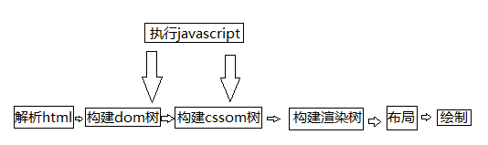
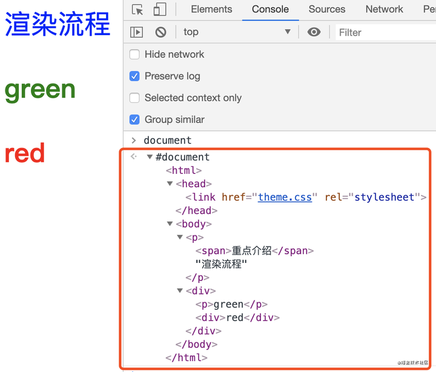

### 浏览器页面渲染
第一步：在CSS资源还没有请求回来之前，先生成DOM树；
第二步：当所有的CSS请求回来之后，浏览器按照CSS的导入顺序，依次进行渲染，最后生成CSSOM树；
第三步：把DOM树和CSSOM树结合在一起，生成有样式，有结构的RENDER TREE渲染树；
最后一步：浏览器按照渲染树，在页面中进行渲染和解析

由于渲染机制过于复杂，渲染模块在在执行过程中划分了很多阶段，通过《浏览器工作原理与实践》-渲染流程上分：构建DOM树，样式计算，布局阶段；渲染流程下分：分层，图层绘制，栅格化（raster）操作，合成和显示。
整个渲染流程，从HTML到DOM、样式计算、布局、图层、绘制、光栅化、合成和显示。

#### 问:为什么要构建dom树？
答：因为浏览器不能直接理解和使用HTML，so，需要将HTML转换为浏览器能够理解的结构，即是DOM树（树结构一般都了解了的）。dom树在浏览器中解释就是元素标签+文本内容

#### 问：CSS加载会阻塞页面显示吗？
答：
css加载不会阻塞DOM树的解析
css加载会阻塞DOM树的渲染
css加载会阻塞后面js语句的执行
<h2>优化</h2>为了防止css阻塞，引起页面白屏，可以提高页面加载速度:
1.使用cdn
2.对css进行压缩
3.合理利用缓存
4.减少http请求，将多个css文件合并
面试问题：下载CSS文件阻塞了，会阻塞DOM树的合成吗？会阻塞页面的显示吗？

答：不会阻塞dom树构建的，因为HTML转化为dom树的过程，发现文件请求会交给网络进程去请求对应文件，渲染进程继续解析HTML。
会阻塞页面的显示，当计算样式的时候需要等待css文件的资源进行层叠样式，资源阻塞了，会进行等待，直到网络超时，network报出错误，渲染进程继续层叠样式计算。

<h2>说说分层</h2>渲染引擎给页面分了很多图层，这些图层按照一定顺序叠加在一起，就形成了最终的页面。完成图层树的构建后，渲染引擎会对图层树中的每个图层进行绘制，为图层绘制。然后进行栅格化（raster）操作（绘制列表只是用来记录绘制顺序和绘制指令的列表，而实际上绘制操作是由渲染引擎中的合成线程来完成的），最后合成与显示。

页面渲染机制如下：

具体可参考：<https://zhuanlan.zhihu.com/p/337059712>
