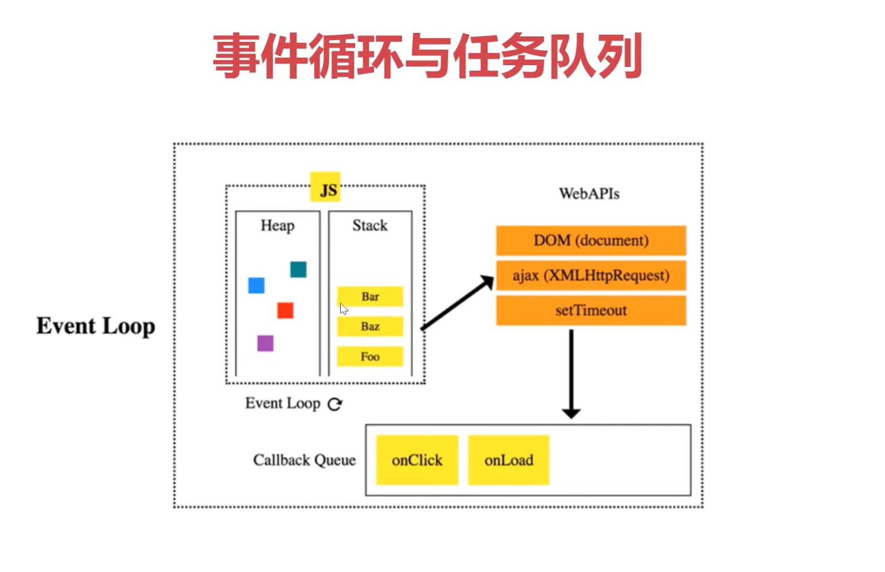

### 概念
队列是一个先进先出的数据结构，不同于栈（后进先出）<br>
javascript 同样也没有队列 也同样可以用Array模拟队列 <br>
```javascript
const queue=[];
queue.push(1);//入队
queue.push(2);
const item1=queue.shift(); // 出对 1
const item2=queue.shift(); // 2
```
### 要点
队列常用操作：push(),shift(),queue[0]  
栈常用操作：push(),pop(),stack[length-1]

### 场景
js异步中的任务队列
计算最近的请求次数......<br>


### for while do-while 循环理解

for 循环: 适合用于已知循环次数的情况下，通常使用 for 来遍历数组或者对象中的元素。

```javascript
// 遍历数组
const arr = [1, 2, 3, 4, 5];
for (let i = 0; i < arr.length; i++) {
  console.log(arr[i]);
}

// 遍历对象
const obj = { a: 1, b: 2, c: 3 };
for (const key in obj) {
  console.log(key + ': ' + obj[key]);
}

```

while 循环: 当我们无法预知循环次数时，可以使用 while 循环，它会在循环体内部执行一定的逻辑，根据逻辑结果来判断是否继续循环。

```javascript
// 随机产生一个数，直到产生的数大于 0.5
let randomNum;
while ((randomNum = Math.random()) < 0.5) {
  console.log(randomNum);
}
```

do-while 循环: 与 while 循环类似，不同之处在于 do-while 循环会先执行一次循环体，再判断是否继续循环。

```javascript
// 随机产生一个数，至少会执行一次循环体
let randomNum;
do {
  randomNum = Math.random();
  console.log(randomNum);
} while (randomNum < 0.5);
```

总的来说，for 循环适用于已知循环次数的情况，
while 循环适用于无法预知循环次数的情况，而 do-while 循环适用于至少需要执行一次循环体的情况。
