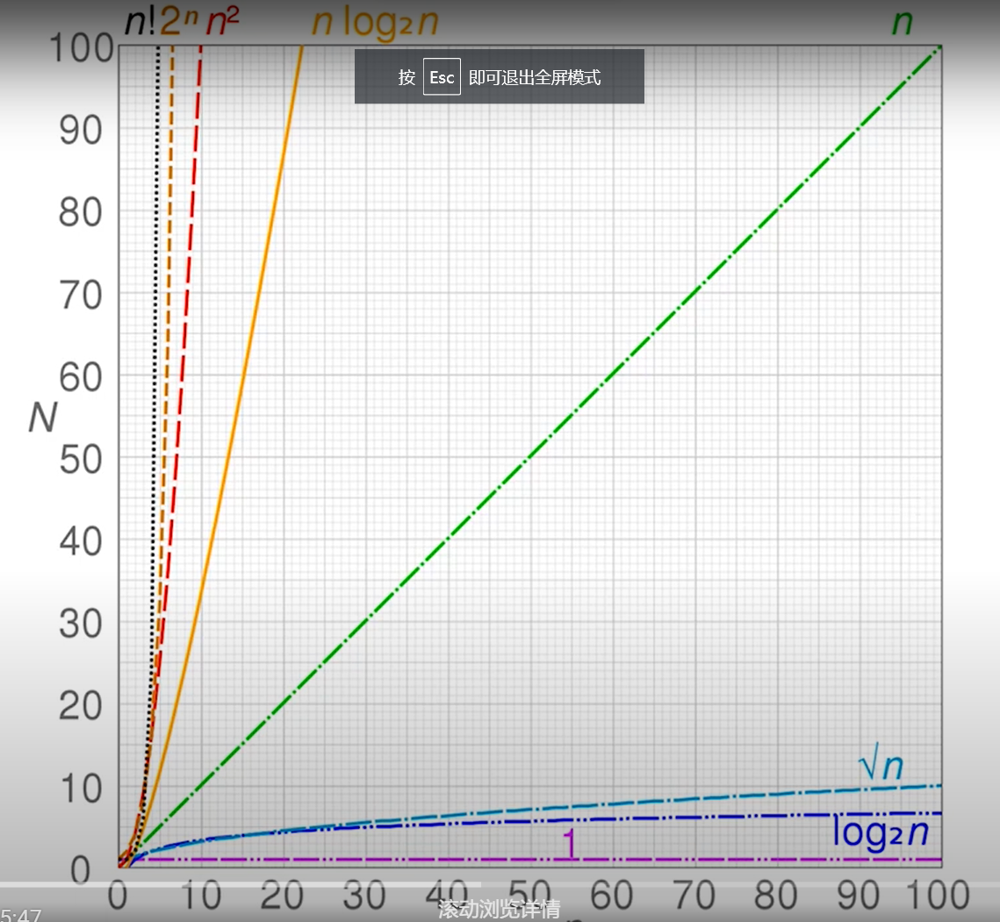

## 概念
数据结构就是计算机存储，组织数据的方式<br>
·栈 队列 链表 （有序的）<br>
·集合 字典（无序的）<br>
·树 堆 图 （有一定的连接关系）<br>

### 时间复杂度
概念：一个定型描述该算法时间的函数
用O表示 比如O(1) O(n) O(logN)...

```js
// O(1)
let i = 0;
i += 1;

// O(N)
for (let i = 0; i < n; i++) {
  console.log(i);
}

// O(logN)
let i = 0;
while (i < n) {
  console.log(i);
  i *= 2;
}
```
#### 注意
时间复杂度相加 取较大的作为结果<br>
O(1) + O(n) = O(n)<br>
时间复杂度相乘 按正常乘法去算<br>
O(n) * O(n) = O(n^2) <br>
