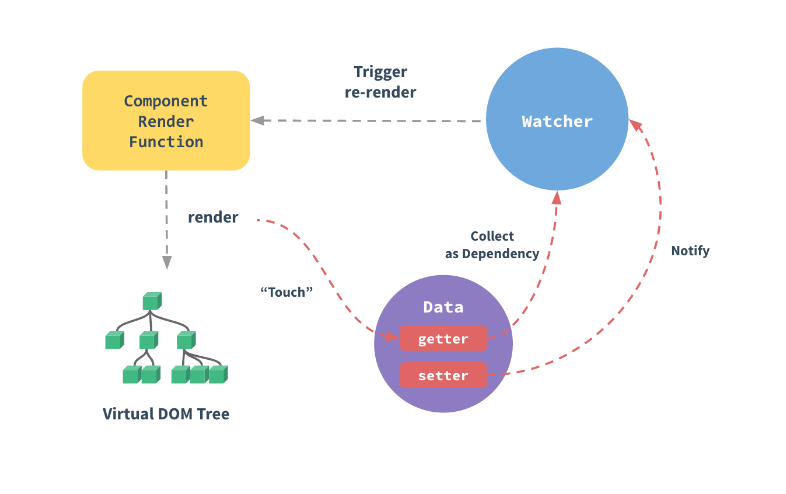

#### 响应式原理
#### vue基本原理
当一个Vue实例创建时，Vue会遍历data中的属性，用 Object.defineProperty（vue3.0使用proxy ）将它们转为 getter/setter，并且在内部追踪相关依赖，在属性被访问和修改时通知变化。 每个组件实例都有相应的 watcher 程序实例，它会在组件渲染的过程中把属性记录为依赖，之后当依赖项的setter被调用时，会通知watcher重新计算，从而致使它关联的组件得以更新。


##### 具体的:
1.源码中observe(data)目的是让传入的整个对象成为响应式的，它会遍历对象的所有属性，然后执行defineReactive()
```js
// new Vue() -> ... -> initState() -> initData()
observe(data)
// observe() -> new Observer() -> observer.walk()
defineReactive(obj, key, value)
```
defineReactive() 就是用于定义响应式数据的核心函数。它主要做的事情包括：

新建一个 dep 对象，与当前数据对应
通过 Object.defineProperty() 重新定义对象属性，配置属性的 set、get，从而数据被获取、设置时可以执行 Vue 的代码。
接下来watcher 的创建过程：
```js
new Watcher(vm, expOrFn, cb, options)
```
在 watcher 对象创建过程中，除了记录 vm、getter、cb 以及初始化各种属性外，最重要的就是调用了传入的 getter 函数：
```js
value = this.getter.call(vm, vm)
```
在 getter 函数的执行过程中，获取读取需要的数据，于是触发了前面通过 defineReactive() 配置的 get 方法：
```js
if (Dep.target) {
  dep.depend()
}
```
再回到 watcher.get() 方法，在执行 getter 函数的前后，分别有如下代码：
```js
pushTarget(this)
// ... 
value = this.getter.call(vm, vm)
// ...
popTarget()
```
pushTarget() 将当前 watcher 设置为 Dep.target，这样在执行到 vm.name 进一步执行对应的 get 方法时，Dep.target 的值就是这里的 watcher，然后通过 dep.depend() 就建立了依赖关系。

dep.depend() 执行的逻辑就比较好推测了，将 watcher（通过 Dep.target 引用到）记录到 dep.subs 中，将 dep 记录到 watcher.deps 中 —— 依赖关系建立了！
具体可参考：<https://zhuanlan.zhihu.com/p/173608124>
#### 总结：
1.通过 Object.defineProperty() 替换配置对象属性的 set、get 方法，实现“拦截”
2.watcher 在执行 getter 函数时触发数据的 get 方法，从而建立依赖关系
3.写入数据时触发 set 方法，从而借助 dep 发布通知，进而 watcher 进行更新
